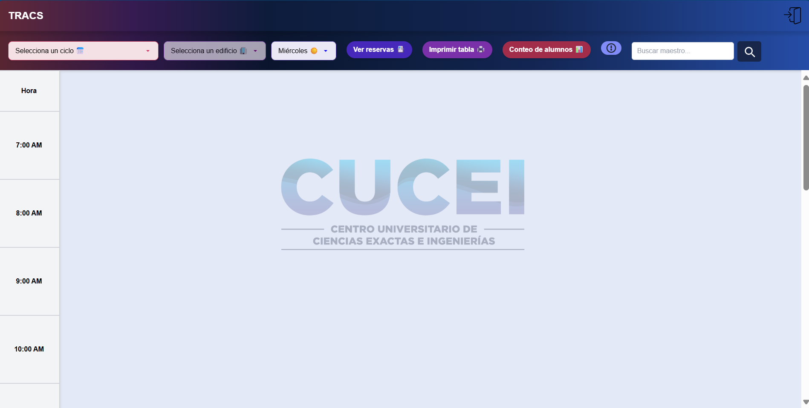
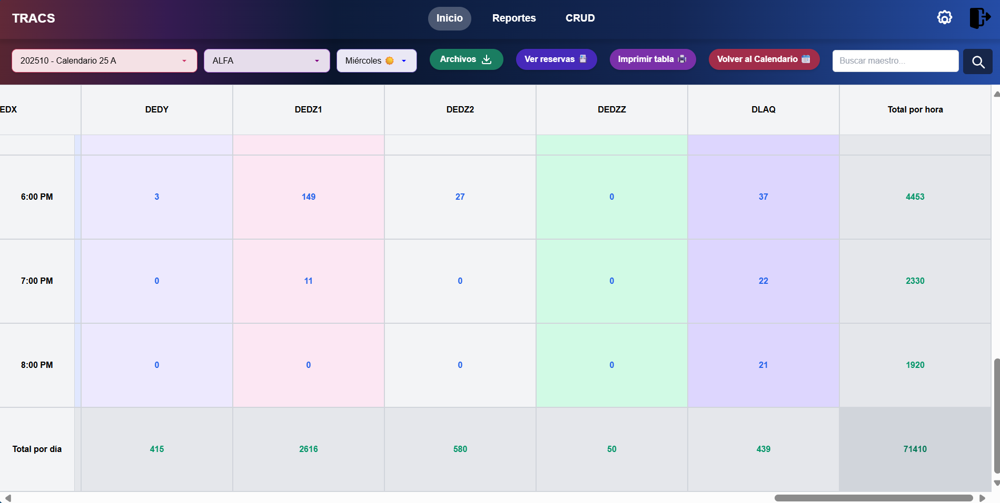
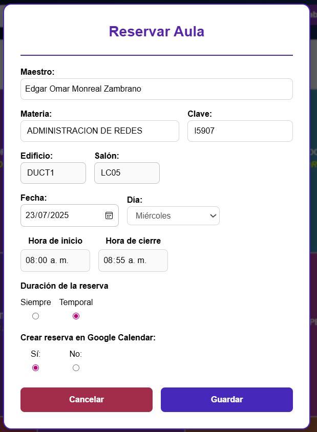
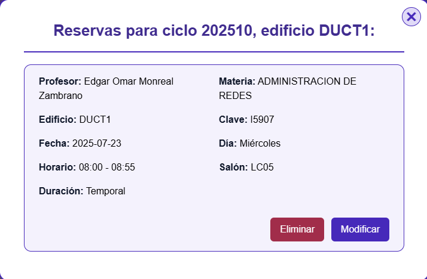
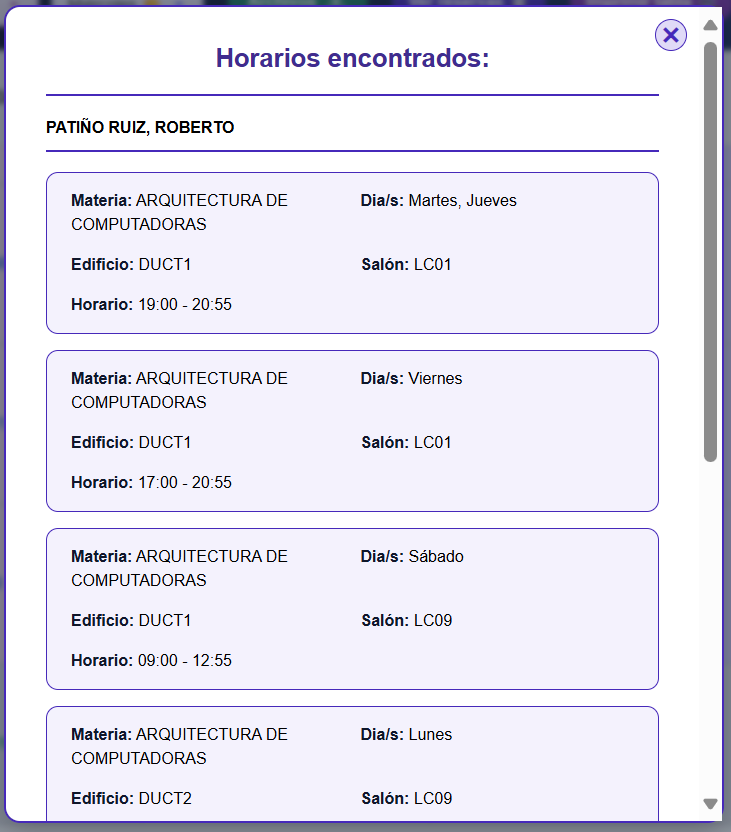
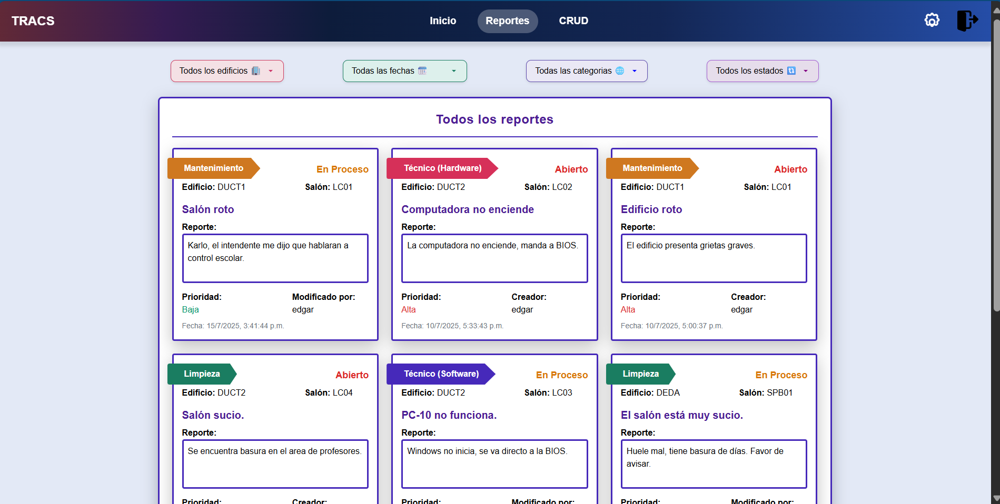
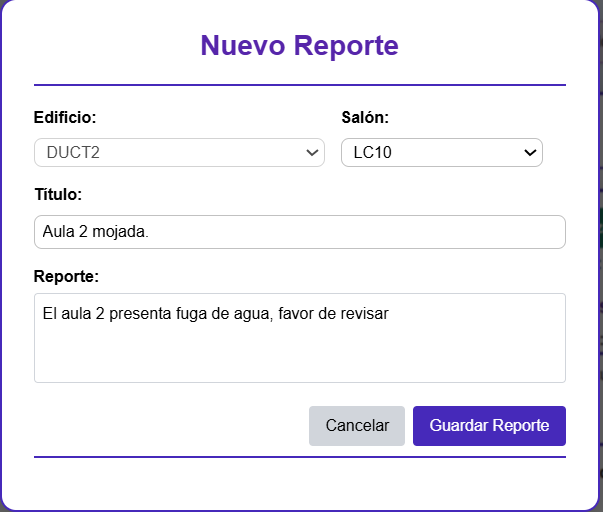
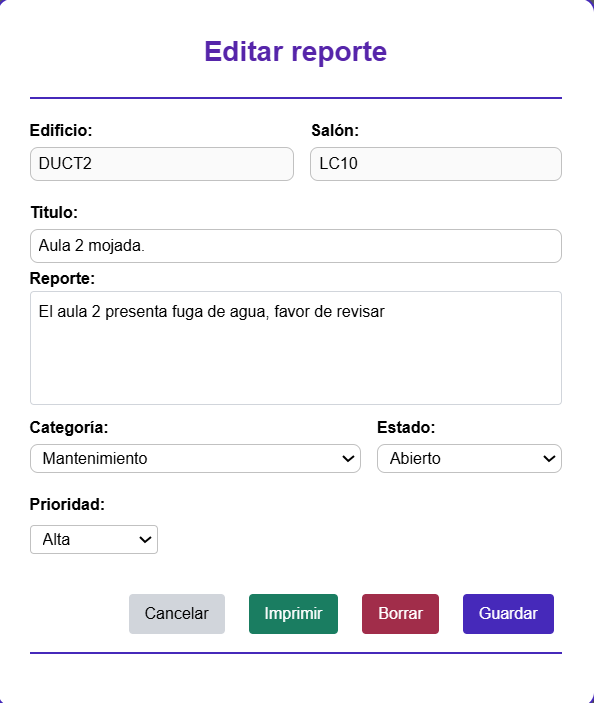

# 📅 TRACS — Sistema de Calendario Académico

**TRACS** (Timetable and Reporting Assistant for CUCEI Services) es una plataforma web diseñada para visualizar y gestionar horarios de clases, reservas de aulas y reportes dentro de CUCEI. Cuenta con control de acceso por roles, soporte para notificaciones en tiempo real y una interfaz intuitiva y moderna.

---

## 🚀 Características principales

### 👤 Visitante
- Visualizar el calendario de clases.
- Consultar reservas de aulas.
- Buscar docentes.
- Ver conteos de alumnos por día.

### 🔐 Usuario autenticado
- Todo lo anterior, además de:
- Ver y crear reportes.
- Acceder a opciones de configuración personalizadas.

### 🛠 Técnico
- Acceso completo del usuario.
- Modificación y seguimiento de reportes.

### 🧑‍💼 Superusuario
- Todas las funcionalidades anteriores.
- Acceso a un CRUD para gestionar usuarios y edificios.

---

## 🖼️ Capturas de pantalla

### Vista de calendario

### Reservas de aulas

### Búsqueda de maestros

### Reportes

